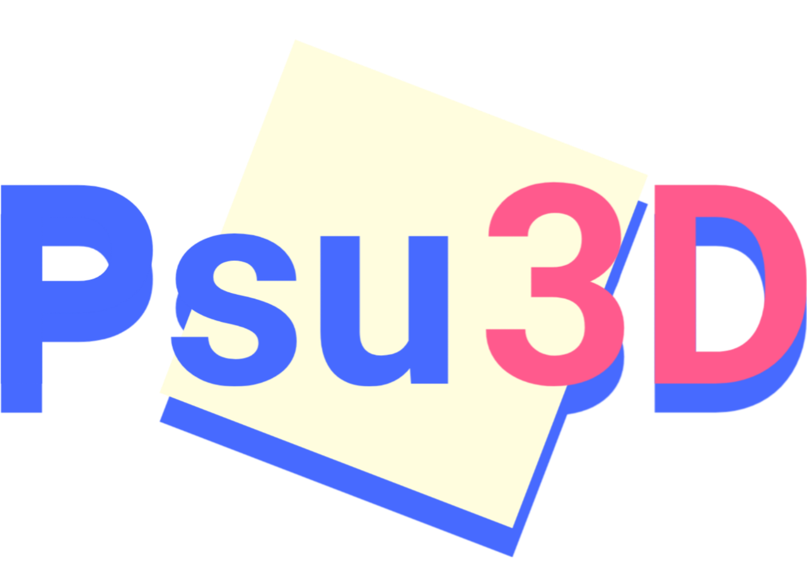

<p align="center">
  
</p>

<p align="center">
  <b>A 3D engine written in pure VBA, running inside PowerPoint.</b>
</p>

<p align="center">
  <a href="https://github.com/uesleibros/psu3d/releases/latest"></a>
  <a href="LICENSE"></a>
  <a href="https://github.com/uesleibros/psu3d/wiki"></a>
  
</p>

Real view transform with yaw and pitch, perspective projection, five plane frustum clipping, backface culling, directional lighting, banded fog, and a painter's algorithm built on separating planes. No DLL, no reference to tick, no build step.

Psu3D is not a game engine. It is a 3D engine that games can be built on, in the same sense that three.js is. The core, meaning canvas, camera, renderer, scene, material and light, does not know the words *player*, *health* or *level*. Terrain, bar charts, data visualisation and a 3D figure on a slide all use the same core and never import the physics.

## Install

Open the VBE with `Alt+F11`, press `Ctrl+M`, and import the files from [`engine/`](engine). Then run `PSelfTest.Psu3DSelfTest`, which is 178 assertions that run in memory, with no slide, and report whether any module was left behind.

Nothing third party is bundled, and **the core calls nothing outside itself**. Only `PLevel` has an external requirement, a JSON parser, which lives at [vbacollective/json](https://github.com/vbacollective/json). Keyboard and mouse are declared inside the demo that uses them.

## The smallest possible example

A static figure on a slide. No loop, no physics, no keyboard. The shapes stay there when the Sub returns.

```vba
Public Sub Terrain()
    Dim x As Long, y As Long, h As Single, ground As Long

    Psu3D.Boot Shapes, 40, 40, 640, 400
    ground = PMaterials.Create("ground", PCore.ColorPack(96, 140, 90)).Id

    Psu3D.Camera.SetPosition -16, -16, 13
    Psu3D.Camera.LookAt 0, 0, 0
    Psu3D.Renderer.PolyBudget = 3000

    For y = 0 To 23
        For x = 0 To 23
            h = 2 + Sin(x * 0.4) * Cos(y * 0.35) * 1.6
            Psu3D.Scene.AddBox ground, x - 12, y - 12, x - 11, y - 11, h, h
        Next x
    Next y

    Psu3D.BeginFrame 0
    Psu3D.RenderScene
    Psu3D.EndFrame
End Sub
```

576 boxes inside a 640 by 400 point rectangle of the slide. Replace `h` with a value from a spreadsheet and it becomes a bar chart. Replace it with noise and it becomes terrain. The engine cannot tell the difference.

## Modules

The first eight are the core. `Psu3D` is a convenience layer. The last four are imported only if you want them.

| module | what it does |
|---|---|
| `PCore.bas` | types, enums, maths, deterministic random, colour, clock |
| `PLighting.bas` | directional light and global fog |
| `PMaterial.cls` | the definition of one surface |
| `PMaterials.bas` | material registry and precomputed shading table |
| `PCanvas.cls` | where and how to project: x, y, width, height, field of view |
| `PCamera.cls` | eye, yaw, pitch, visibility test |
| `PRenderer.cls` | face to polyline pipeline, and the primitives |
| `PScene.cls` | object store in parallel arrays, spatial index, draw order |
| `PBody.cls` | a body that walks, collides, steps up, climbs, swims and is carried |
| `PLevel.bas` | read and write a scene as JSON |
| `Psu3D.bas` | facade |
| `PSelfTest.bas` | library self test |
| `PDemo.bas` | playable example level |

## Documentation

Everything is in [`docs/`](docs), and the same content is published to the [wiki](https://github.com/uesleibros/psu3d/wiki): guides by subject, how the 3D works internally, and the complete reference for all 343 public members, generated from the docstrings in the source.

| page | subject |
|---|---|
| [Installation](docs/Installation.md) | importing, and the one external module |
| [Getting started](docs/Getting-Started.md) | seeing something on screen |
| [Concepts](docs/Concepts.md) | how the pieces fit together |
| [How the 3D works](docs/How-The-3D-Works.md) | it is real 3D, and where the boundary is |
| [Body and physics](docs/Body-And-Physics.md) | walking, jumping, climbing, swimming, platforms |
| [Levels in JSON](docs/Levels-In-JSON.md) | the complete format |
| [Recipes](docs/Recipes.md) | ready made examples to copy |
| [Depth sorting](docs/Depth-Sorting.md) | the painter's algorithm in here |
| [Spatial index](docs/Spatial-Index.md) | the grid that keeps physics cheap |
| [Performance](docs/Performance.md) | the refresh pump, double buffering, budget |
| [Known limits](docs/Known-Limits.md) | what the library does not do, and why |

## Example level

[`examples/obby.json`](examples/obby.json) is a linear open air obstacle course: there is no ground, falling kills you and returns you to the last checkpoint. 38 objects, 5 checkpoints, moving platforms, spinning discs, ice, a trampoline, one way platforms and a lift.

```vba
PDemo.RunFile "C:\path\obby.json"
```

## The rules the library follows

**No `On Error` anywhere.** Every path that could raise is checked by hand. `On Error` in VBA hides the fault instead of handling it.

**`Option Private Module` in every `.bas`**, and `VB_Exposed = False` on every class, so the library does not leak into the rest of the file.

**Plain arrays, no COM on the hot path.** The only shape reads in the whole engine run at boot.

**No fixed ceilings.** Everything grows by doubling.

## Correctness

Two things in the library can be wrong rather than merely slow, and both are measured rather than assumed.

**Depth sorting** is checked against an exact oracle that runs the separating axis test on the true oriented shapes, counting only pairs that actually overlap on screen: 0.00% visible artefacts on `obby.json` across 1,743 camera positions, and 1.01% on a scene built deliberately to be hostile, where the remainder is geometry that genuinely interpenetrates.

**The spatial index** is compared against the full sweep it replaces across 120,000 random queries on scenes built out of what breaks grids: zero divergences.

## License

MIT. See [LICENSE](LICENSE).
